<!-- PROJECT LOGO -->
 

  

  <h3 align="center">4x2 SRAM</h3>

  

    Design, Simulation, and Layout of a 4x2 SRAM 
     
    <a href="https://github.com/harshit-raj15/VLSI-4x2-SRAM/blob/main/4x2%20SRAM_Group-%20Bits%20and%20Bytes.pdf"><strong>Explore the docs »</strong></a>
     
     
    <a href="#usage">View Final SRAM</a>
  

<!-- TABLE OF CONTENTS -->

  
Table of Contents

  <ol>
    <li>
      <a href="#about-the-project">About The Project</a>
    </li>
    <li><a href="#about-the-components">About the Components</a></li>
    <li><a href="#finalsram">Final SRAM</a></li>
    <li><a href="#license">License</a></li>
    <li><a href="#authors">Authors</a></li>
    <li><a href="#acknowledgements">Acknowledgements</a></li>
  </ol>

<!-- ABOUT THE PROJECT -->

## About The Project

This project presents the design, simulation, and layout of an 8-bit (4x2) SRAM array using 6-transistor (6T) cells, composed of two pass transistors and two inverters per cell. Supporting circuits, including row and column decoders, read-write circuits, precharge circuits, and sense amplifiers, ensure reliable and efficient memory operations. The row decoder activates word lines, while the column decoder connects selected bitlines to the circuits for precise cell selection. Precharge circuits initialize bitlines to a known voltage level, and sense amplifiers amplify small voltage differences for accurate data retrieval. The design balances performance, power consumption, and area while adhering to design rules, with the layout verified through DRC and LVS processes. The findings confirm that the SRAM array meets predefined performance criteria under 45nm process variability, making it suitable for high-speed cache memory applications.

[4*2 SRAM](https://github.com/harshit-raj15/VLSI-4x2-SRAM/blob/main/4x2%20SRAM_Group-%20Bits%20and%20Bytes.pdf)

### List of Components Used
- 2 Input NAND Gate
- Inverter
- Column Decoder
- Row Decoder
- Precharge
- Sense Amp
- Read Write Circuit
- SRAM Cell

<!-- ABOUT THE PROJECT -->

## About the Components

The design of an SRAM array involves various key components which work together to enable efficient address decoding, data storage, and reliable read/write operations.

### 2 Input NAND Gate

A 2-input NAND gate works by producing a high output signal only when either or both of its inputs are low.

  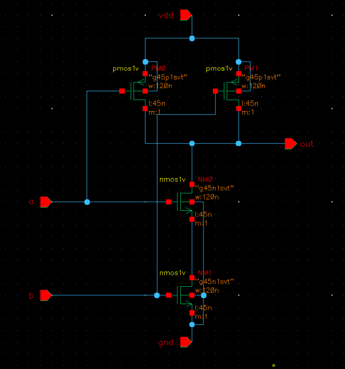
  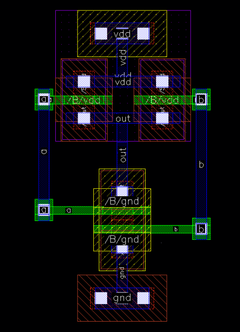

### Inverter

An inverter gate, also known as a NOT gate, is a logic gate that inverts the input signal it receives. If input is 1 then output is 0 and if input is 0 then output is 1.

  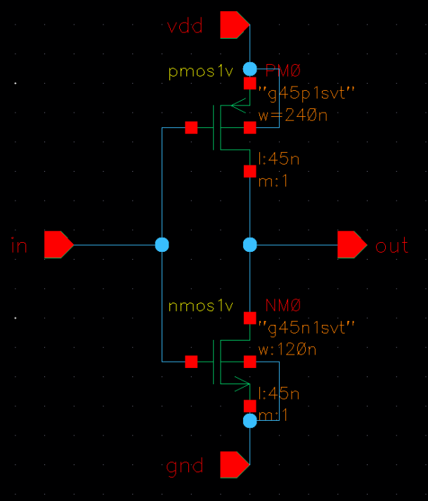
  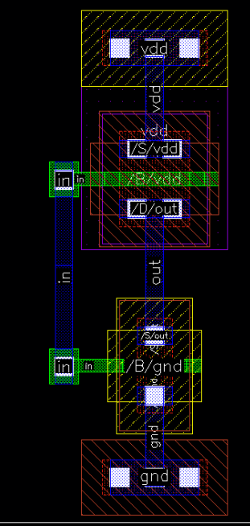

### Column Decoder

To complete the 4*2 SRAM we are using a 1:2 column decoder. It works in conjunction with the row decoder to select specific columns in the selected row. Once a row has been selected by the row decoder, the column ecoder further restricts the selection by including only one of the two-bit rows corresponding to the selected column.

  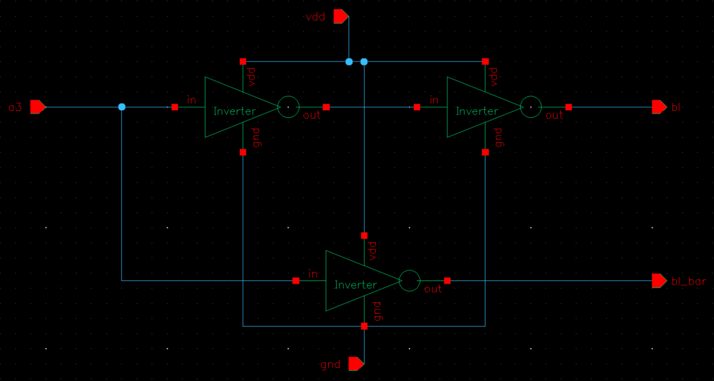
  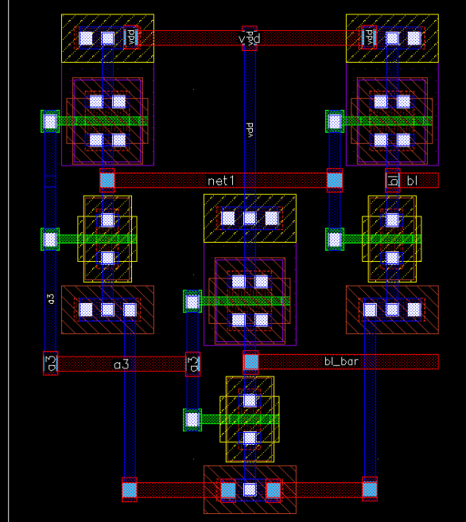

### Row Decoder

During a read or write operation, the row decoder controls which row of memory cells will be accessed.  In a 4x2 SRAM with 4 rows, the row decoder will usually select one of the 4 word lines (WL0 to WL3) using 2 address bits (A1 and A0). It selects the word line as per the input given to the decoder.

  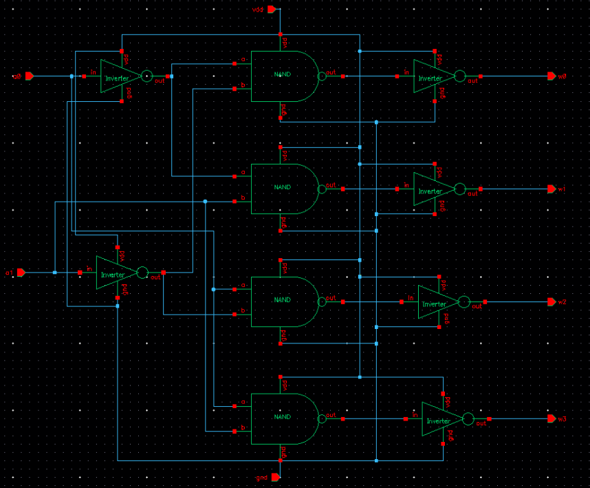
  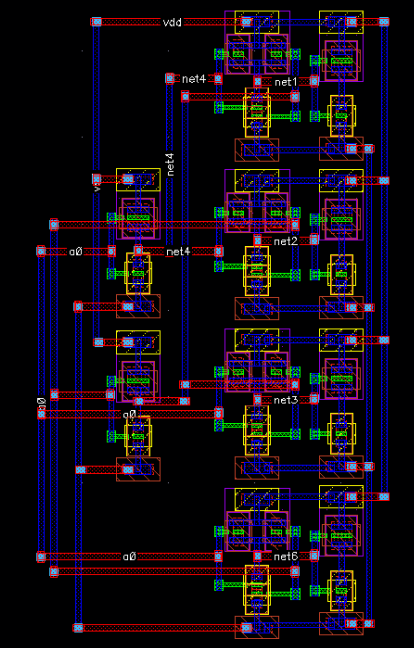

### Precharge

The precharge circuit is responsible for preparing the bitline and bitline bar for read and write operation. The precharge circuit ensures the bitlines are precharges to Vdd or Vdd/2 before every operation for a successful read and write.

  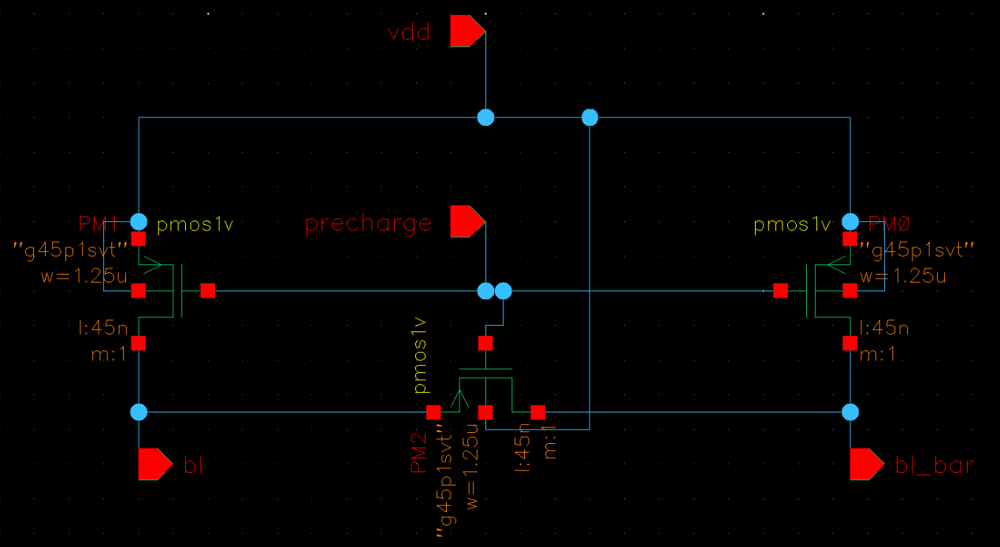
  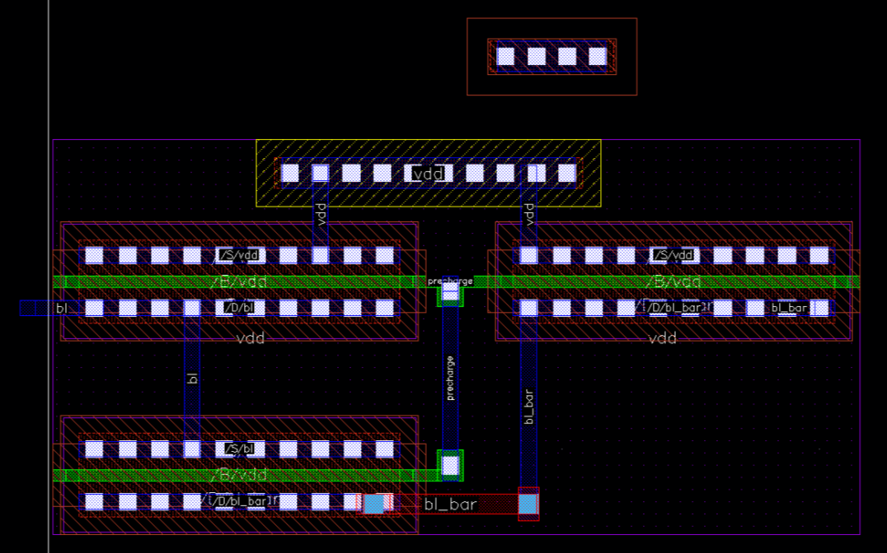

### Sense Amp

The cross coupled sense amplifier equipped with a transmission gate, provides reliable and efficient read operations. The design utilizes the pair of cross coupled inverters to detect minimal difference in the bit and bitline bar and amplify the result to a full logic level for a successful read operation.

  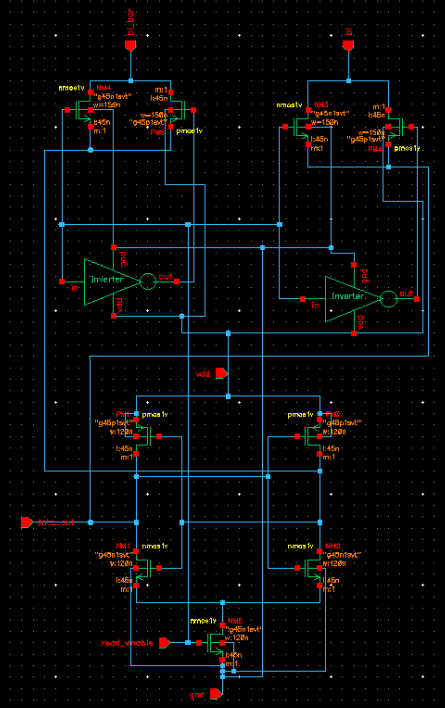
  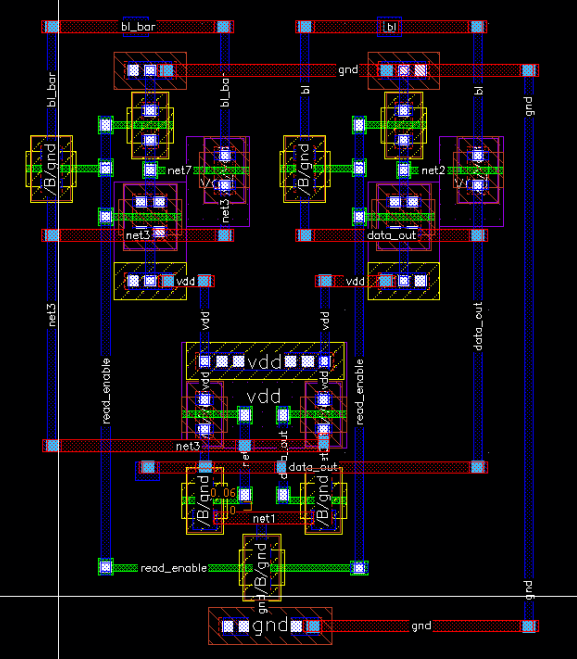

### Read Write Circuit

The write driver circuit enables data writing by applying specific voltage levels to the bitline and bitline bar, temporarily overriding the memory cell's cross-coupled latch.
While writing a 1, the bitline is driven to 1 and the bitline bar is driven to a 0. Similarly, to write a 0, bitline is driven to a logic 0 and the bitline bar is pulled up to a logic 1.

  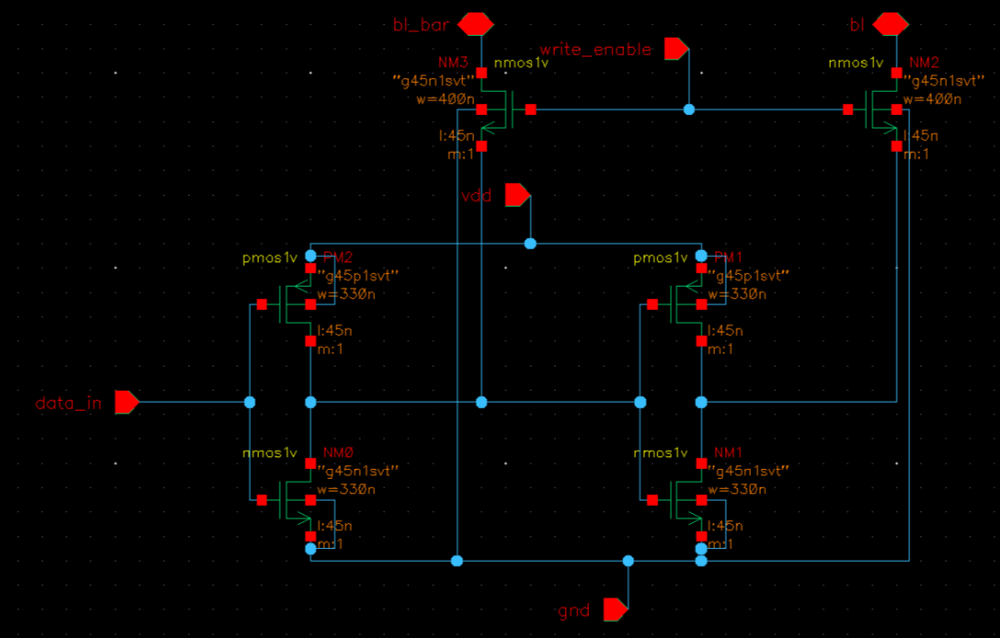
  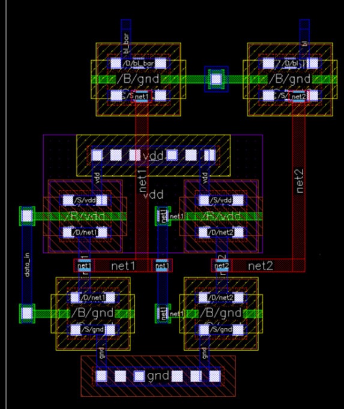

### SRAM Cell

The SRAM bit cell block is the main building block of the whole 4*2 SRAM. The most common implementation is the 6T SRAM cell, which offers an excellent balance of performance, reliability, and density.

  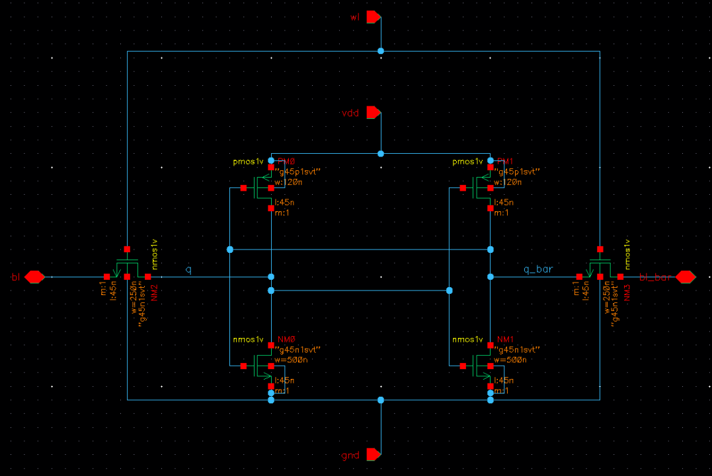
  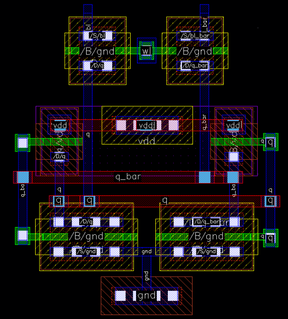

<!-- USAGE EXAMPLES -->

## Final SRAM

The following images show the complete 4x2 SRAM after combining all the components.

  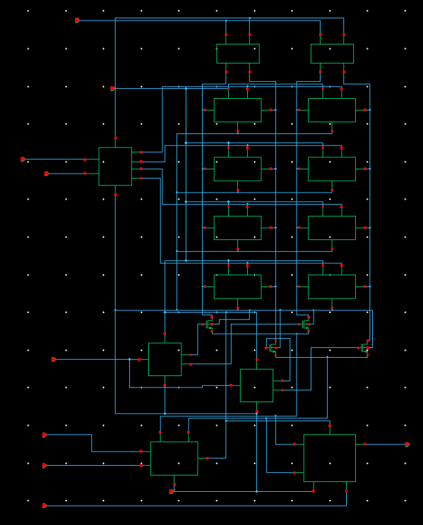
  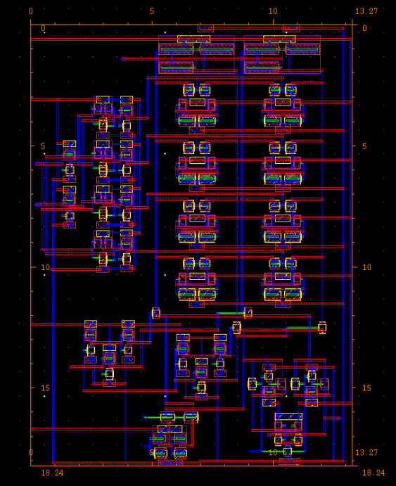

<!-- LICENSE -->

## License

All softwares are free to use for commercial and educational purposes with proper references given.

<!-- Authors -->

## Authors

Harshit Raj - harshitraj@ufl.edu

Nitesh Bakhati - nitesh.bakhati@ufl.edu

Project Link: [https://github.com/harshit-raj15/VLSI-4x2-SRAM](https://github.com/harshit-raj15/VLSI-4x2-SRAM)

<!-- ACKNOWLEDGEMENTS -->

## Acknowledgements

- [Scott Thompson](https://www.ece.ufl.edu/people/faculty/scott-thompson/)
- [Cadence Tool](https://www.cadence.com/en_US/home.html)

References:

M.-H. Sheu, S. M. S. Morsalin, C.-M. Tsai, C.-J. Yang, S.-C. Hsia, Y.-H. Hsueh, J.-F. Lin, and C.-Y. Chang, "Stable Local Bit-Line 6 T SRAM Architecture Design for Low-Voltage Operation and Access Enhancement," Electronics, vol. 10, no. 6, p. 685, Mar. 2021. DOI: 10.3390/electronics10060685.

M.-F. Chang, S.-W. Chang, P.-W. Chou, and W.-C. Wu, "A 130 mV SRAM with Expanded Write and Read Margins for Subthreshold Applications," IEEE Journal of Solid-State Circuits, vol. 46, no. 2, pp. 520–529, Feb. 2011.

K. Shin, W. Choi, and J. Park, "Half-Select Free and Bit-Line Sharing 9T SRAM for Reliable Supply Voltage Scaling," IEEE Transactions on Circuits and Systems I: Regular Papers, vol. 64, no. 8, pp. 2036–2048, Aug. 2017.

T.-H. Tu et al., "A Single-Ended Disturb-Free 9T Subthreshold SRAM With Cross-Point Data-Aware Write Word-Line Structure, Negative Bit-Line, and Adaptive Read Operation Timing Tracing," IEEE Journal of Solid-State Circuits, vol. 47, no. 6, pp. 1469–1482, Jun. 2012.

S.-K. Lee et al., "12.3 A low-power and high-performance 10nm SRAM architecture with dual-rail design," IEEE International Solid-State Circuits Conference (ISSCC), pp. 210–211, Feb. 2017.
